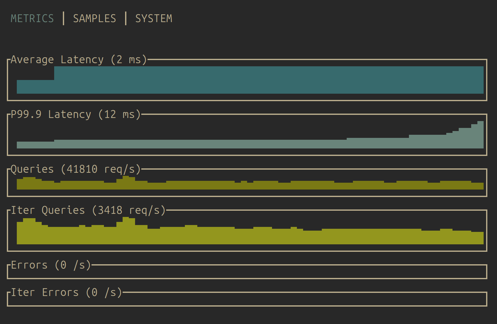

# Skylar

A load testing tool for ScyllaDB

    Usage: skylar [OPTIONS]

    Options:
          --host <HOST>
              Host Default value: localhost:9042 [default: localhost:9042]
      -c, --consistency-level <CONSISTENCY_LEVEL>
              Consistency level Possible values: ONE, TWO, THREE, QUORUM, ALL, LOCAL_QUORUM, EACH_QUORUM, SERIAL, LOCAL_SERIAL, LOCAL_ONE Default value: LOCAL_QUORUM [default: LOCAL_QUORUM]
      -r, --replication-factor <REPLICATION_FACTOR>
              Replication factor Default value: 1 [default: 1]
      -d, --datacenter <DATACENTER>
              Datacenter Default value: datacenter1 [default: datacenter1]
          --read-threads <READ_THREADS>
              Number of read threads [default: 10]
          --write-threads <WRITE_THREADS>
              Number of write threads [default: 90]
          --payload <PAYLOAD>
              Payload type [default: devices]
      -h, --help
              Print help
